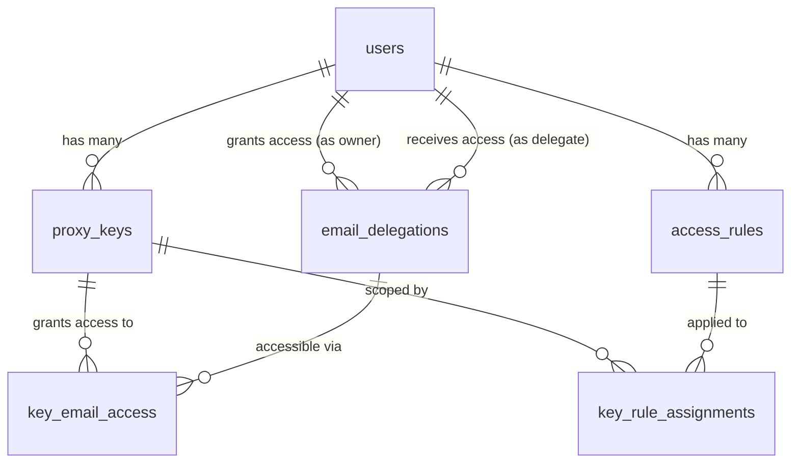

# V6: Delegation-Based Multi-Email Access

## Problem

Clerk limits each user to **one external account per provider**. We can't connect multiple Google accounts to a single Clerk user. Our original V5 architecture assumed this was possible — it is not.

## Solution: Cross-User Delegation

Each Gmail account = its own Clerk user. Users grant other users permission to act on their email via a **delegation** relationship tracked in our DB. Clerk continues to manage all OAuth tokens and refresh cycles — we never touch tokens.



### How It Works

1. **User A** (`kyesh@umich.edu`) signs up via "Sign in with Google" → Clerk stores their Google OAuth token
2. **User B** (`kenyesh2@gmail.com`) is already signed up
3. **User A** visits their own dashboard, clicks **"Delegate Access"**, enters User B's email → creates a delegation
4. **User B's** dashboard now shows `kyesh@umich.edu` as a delegated email they can assign to API keys and create rules for
5. When the proxy needs to access `kyesh@umich.edu`'s Gmail, it calls `getUserOauthAccessToken(userA.clerkUserId, 'oauth_google')` — **Clerk handles token refresh**

---

## Schema Changes

### [NEW] `email_delegations` table — replaces `connected_emails`

```sql
email_delegations:
  id              uuid PK
  owner_user_id   uuid FK → users.id (CASCADE)  -- The user who owns the Gmail
  delegate_user_id uuid FK → users.id (CASCADE) -- The user who can act on it
  status          text NOT NULL  -- 'pending', 'active', 'revoked'
  created_at      timestamp DEFAULT now()
  revoked_at      timestamp NULL
  UNIQUE(owner_user_id, delegate_user_id)
```

- **Owner**: The user whose Gmail account will be accessed (they own the Clerk OAuth token)
- **Delegate**: The user who can create API keys and rules to access the owner's email
- Owner's email comes from `users.email` (their Clerk primary email = their Google account)
- Owner's Clerk user ID is used to fetch the Google token via `getUserOauthAccessToken()`

### [DELETE] `connected_emails` table

No longer needed — the delegation table + `users.email` replaces it.

### [MODIFY] `key_email_access` — now references delegations

```diff
 key_email_access:
   id                 uuid PK
   proxy_key_id       uuid FK → proxy_keys.id (CASCADE)
-  connected_email_id uuid FK → connected_emails.id (CASCADE)
+  delegation_id      uuid FK → email_delegations.id (CASCADE)
   UNIQUE(proxy_key_id, delegation_id)
```

### Other tables — no changes

`proxy_keys`, `access_rules`, `key_rule_assignments` remain the same.

---

## Proxy Route Changes

### [MODIFY] [route.ts](file:///Users/kennethyesh/GitRepos/googleapis_fine_grain_access_control/src/app/api/proxy/%5B...path%5D/route.ts)

Line 206 currently calls:
```typescript
client.users.getUserOauthAccessToken(dbUser.clerkUserId, 'oauth_google')
```

**Change**: Look up the delegation for the target email → get the **owner's** Clerk user ID → fetch their token:

```typescript
// Find the delegation that covers this email
const delegation = await db.select()
  .from(emailDelegations)
  .innerJoin(users, eq(users.id, emailDelegations.ownerUserId))
  .where(and(
    eq(users.email, targetEmail),
    eq(emailDelegations.delegateUserId, dbUser.id), // key owner is the delegate
    eq(emailDelegations.status, 'active'),
  ))
  .limit(1).then(res => res[0]);

// Also support the user's own email (self-delegation implicit)
const ownerClerkUserId = delegation
  ? delegation.users.clerkUserId  // delegated email
  : dbUser.clerkUserId;           // own email

const tokenResponse = await client.users.getUserOauthAccessToken(ownerClerkUserId, 'oauth_google');
```

---

## Dashboard UX Changes

### Owner's View (the person delegating)

| Action | Description |
|--------|-------------|
| **"Delegate Access"** button | Enter another user's email → creates a `pending` delegation |
| **Active Delegations** list | See who has access to your email, revoke anytime |

### Delegate's View (the person receiving access)

| Section | Change |
|---------|--------|
| **Connected Emails** | Shows own email (always) + all emails delegated to them with `status='active'` |
| **API Keys** | When creating a key, can grant access to own email AND any delegated emails |
| **Pending Invitations** | Shows if someone has requested to delegate to you (if we do request-based flow) |

### UX Flow Options

**Option A — Owner initiates (recommended for our use case):**
1. User A signs in, goes to dashboard, clicks "Delegate Access"
2. Enters User B's email (kenyesh2@gmail.com)
3. Delegation is instantly active (since User A is the owner, they're granting their own access)
4. User B's dashboard now shows User A's email

**Option B — Delegate requests:**
1. User B clicks "Request Access to Email"
2. Enters kyesh@umich.edu
3. User A sees a pending request, approves it
4. More secure but adds UX friction

> [!IMPORTANT]
> For the single-user case (you own both Gmail accounts), **Option A** is simplest — you sign in as each Gmail, go to dashboard, and delegate to the other. No approval flow needed since YOU are the owner granting access.

---

## Migration Plan

### [NEW] `0002_email_delegations.sql`

1. Create `email_delegations` table
2. Migrate existing `connected_emails` data → create self-delegations (owner = delegate = same user)
3. Update `key_email_access` FK from `connected_email_id` → `delegation_id`
4. Drop `connected_emails` table

---

## Verification Plan

1. Sign in as `kenyesh2@gmail.com` — verify own email appears
2. Sign in as `kyesh@umich.edu` — delegate access to `kenyesh2@gmail.com`
3. Sign back in as `kenyesh2@gmail.com` — verify `kyesh@umich.edu` now appears as delegated
4. Create an API key with access to both emails
5. Use the key to access `kyesh@umich.edu`'s Gmail via proxy — verify it works
6. Revoke the delegation as `kyesh@umich.edu` — verify access is denied
