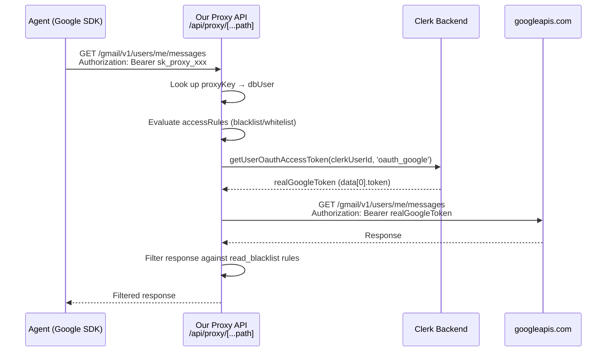

# Feature: Multi-Gmail-Account Support via the SecureAgent Proxy

## Current Architecture (as-is)



**Key detail**: The agent uses the standard Google SDK with an endpoint override pointed at our proxy. The `proxyKey` is a "fake token" — if an agent tries to use it directly with Google, it gets a 401. Clerk is the **sole token vault**; we never store Google tokens ourselves.

### Current Data Model Gap
- `users` table has a single `email` field and a single `proxyKey`.
- `accessRules` are scoped to a `userId`, **not** to a specific email address.
- The proxy grabs `tokenResponse.data[0]` — hardcoded to the first Google connection.

---

## The Core Question: Single Key (DWD-style) vs. Per-Email Key

### Option A: Single `proxyKey` — DWD-style (Recommended)

The user gets **one proxyKey** that can access all of their connected Gmail accounts. The agent specifies *which* email to act as via the Gmail API's existing `userId` path parameter.

**How it works on the Agent side** (zero SDK changes beyond the existing endpoint override):
```typescript
// Agent code — standard Google SDK, already configured for our proxy
const gmail = google.gmail({ version: 'v1', auth: proxyAuth });

// Access personal email
gmail.users.messages.list({ userId: 'personal@gmail.com' });

// Access work email — same key, same client
gmail.users.messages.list({ userId: 'work@company.com' });
```

The Gmail API already accepts an email address as the `userId` parameter (not just `'me'`). Our proxy intercepts this, looks up which Clerk `externalAccount` maps to that email, fetches the correct token, and forwards.

**Pros:**
- Mirrors how DWD works conceptually — one credential, multiple mailboxes
- Simplest agent-side experience (one key to manage)
- Access rules can be scoped per-email, giving the user granular control ("Block 2FA on my work email, but allow it on personal")
- The user can revoke all agent access by rolling one key

**Cons / Risks:**
- A compromised single key exposes all connected accounts
- Must validate that the user actually *wants* the agent to access a given email (authorization check)
- Slightly more complex proxy logic to resolve `userId` → correct Clerk token

---

### Option B: Per-Email `proxyKey`

The user gets a **separate proxyKey per connected email**. Each key can only access one specific Gmail account.

**How it works on the Agent side:**
```typescript
// Agent must create separate auth clients per email
const personalAuth = new google.auth.OAuth2();
personalAuth.setCredentials({ access_token: 'sk_proxy_personal_xxx' });
const personalGmail = google.gmail({ version: 'v1', auth: personalAuth });

const workAuth = new google.auth.OAuth2();
workAuth.setCredentials({ access_token: 'sk_proxy_work_xxx' });
const workGmail = google.gmail({ version: 'v1', auth: workAuth });
```

**Pros:**
- Blast radius of a compromised key is limited to one email
- Simpler proxy logic (key → email is 1:1)
- User can selectively revoke access to one email without affecting others

**Cons / Risks:**
- Agent must manage multiple credentials — more friction
- Doesn't match how DWD works (breaks the mental model of "one service identity")
- Access rules are implicitly scoped (each key = one email), but cross-email rules become harder

---

## Recommendation: Option A (single key) with per-email authorization

> [!IMPORTANT]
> **My recommendation is Option A** for the following reasons:
> 1. It matches the DWD mental model your users expect
> 2. The Gmail API's `userId` parameter already naturally supports this — no SDK hacks needed
> 3. Access rules in your `accessRules` table just need one new column (`targetEmail`) to scope rules per-account
> 4. The user can still limit which emails are "agent-accessible" via the dashboard
>
> The main risk (compromised key = all accounts) is mitigated by:
> - The key only works through our proxy (it's a fake token)
> - Our proxy enforces access rules regardless
> - Key rolling is already on the roadmap

---

## Proposed Changes (Option A)

### Schema Changes

#### [MODIFY] [schema.ts](file:///Users/kennethyesh/GitRepos/googleapis_fine_grain_access_control/src/db/schema.ts)

```diff
 export const users = pgTable('users', {
   id: uuid('id').defaultRandom().primaryKey(),
   clerkUserId: text('clerk_user_id').notNull().unique(),
-  email: text('email').notNull(),
+  email: text('email').notNull(), // Primary Clerk email (unchanged)
   proxyKey: text('proxy_key').unique(),
   createdAt: timestamp('created_at').defaultNow().notNull(),
   updatedAt: timestamp('updated_at').defaultNow().notNull(),
 });

+// Tracks which Google accounts a user has connected via Clerk
+// No tokens stored here — Clerk is the token vault
+export const connectedEmails = pgTable('connected_emails', {
+  id: uuid('id').defaultRandom().primaryKey(),
+  userId: uuid('user_id').references(() => users.id, { onDelete: 'cascade' }).notNull(),
+  googleEmail: text('google_email').notNull(),
+  label: text('label'), // e.g., "Personal", "Work", "School"
+  clerkExternalAccountId: text('clerk_external_account_id').notNull(),
+  isAgentAccessible: boolean('is_agent_accessible').default(true).notNull(),
+  createdAt: timestamp('created_at').defaultNow().notNull(),
+});

 export const accessRules = pgTable('access_rules', {
   id: uuid('id').defaultRandom().primaryKey(),
   userId: uuid('user_id').references(() => users.id, { onDelete: 'cascade' }).notNull(),
+  targetEmail: text('target_email'), // NULL = applies to all emails, or specific email
   ruleName: text('rule_name').notNull(),
   ...
 });
```

### Proxy Logic Changes

#### [MODIFY] [route.ts](file:///Users/kennethyesh/GitRepos/googleapis_fine_grain_access_control/src/app/api/proxy/%5B...path%5D/route.ts)

1. Extract the `userId` from the Gmail API path (e.g., `/gmail/v1/users/work@company.com/messages`)
2. If `userId` is `'me'`, default to the user's primary email
3. Look up `connectedEmails` to verify this email belongs to the user and `isAgentAccessible` is true
4. Fetch **all** OAuth tokens from Clerk, filter by `externalAccountId` matching the target email
5. Evaluate access rules filtered by `targetEmail` (or global rules where `targetEmail` is NULL)

### Dashboard Changes

#### [MODIFY] [page.tsx](file:///Users/kennethyesh/GitRepos/googleapis_fine_grain_access_control/src/app/dashboard/page.tsx)

- Show connected Google accounts (synced from Clerk's `externalAccounts`)
- Allow toggling `isAgentAccessible` per email
- When creating access rules, allow scoping to a specific email or "all"

---

## Verification Plan

### Manual Verification
1. Connect two Google accounts via Clerk `<UserProfile />`
2. Sync them to `connectedEmails` table
3. Using one `proxyKey`, make two Gmail API calls with different `userId` values
4. Confirm each call hits the correct inbox
5. Toggle `isAgentAccessible` off for one email and confirm the proxy returns 403
6. Create a `read_blacklist` rule scoped to one email and confirm it only applies to that inbox
