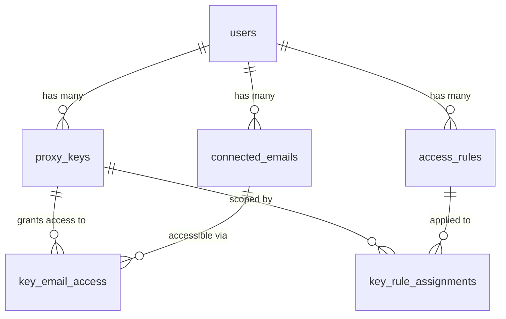
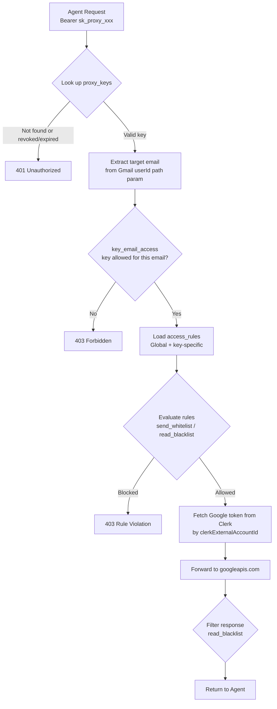

# Feature: Multi-Gmail-Account + Multi-Key Support

## Current Architecture

Agents use the standard Google SDK pointed at our proxy (`/api/proxy/[...path]`). They authenticate with a `proxyKey` ("fake token"). Our proxy evaluates `accessRules`, fetches the real Google OAuth token from Clerk, and forwards to `googleapis.com`. The agent never touches real credentials.

**Current gap**: 1 user → 1 email → 1 key → 1 Clerk Google connection. No multi-account, no multi-key.

---

## Proposed Schema



### [MODIFY] [schema.ts](file:///Users/kennethyesh/GitRepos/googleapis_fine_grain_access_control/src/db/schema.ts)

#### `users` — remove `proxyKey` column
```diff
 export const users = pgTable('users', {
   id: uuid('id').defaultRandom().primaryKey(),
   clerkUserId: text('clerk_user_id').notNull().unique(),
   email: text('email').notNull(),
-  proxyKey: text('proxy_key').unique(),
   createdAt: timestamp('created_at').defaultNow().notNull(),
   updatedAt: timestamp('updated_at').defaultNow().notNull(),
 });
```

#### `proxy_keys` — multiple keys per user with invalidation
```sql
proxy_keys:
  id             uuid PK
  user_id        uuid FK → users.id (CASCADE)
  key            text UNIQUE NOT NULL     -- "sk_proxy_xxx"
  label          text NOT NULL            -- "Claude Agent", "Work Bot"
  revoked_at     timestamp NULL           -- NULL = active, set = revoked
  expires_at     timestamp NULL           -- optional TTL
  created_at     timestamp DEFAULT now()
```

- **Invalidation**: Set `revokedAt` to current timestamp. Proxy checks `revokedAt IS NULL` on every request.
- **Key rolling**: Generate new key → revoke old key (atomic transaction).
- **TTL**: Optional `expiresAt` for time-limited keys.

#### `connected_emails` — which Google accounts are linked (no tokens)
```sql
connected_emails:
  id                       uuid PK
  user_id                  uuid FK → users.id (CASCADE)
  google_email             text NOT NULL
  label                    text           -- "Personal", "Work", "School"
  clerk_external_account_id text NOT NULL  -- to look up the right Clerk token
  created_at               timestamp DEFAULT now()
```

#### `key_email_access` — which keys can access which emails
```sql
key_email_access:
  id                 uuid PK
  proxy_key_id       uuid FK → proxy_keys.id (CASCADE)
  connected_email_id uuid FK → connected_emails.id (CASCADE)
  UNIQUE(proxy_key_id, connected_email_id)
```

- If a key has **no rows** in this table, it can access **no emails** (deny by default).
- To grant a key access to all emails, insert a row for each connected email.

#### `access_rules` — stays scoped to user (reusable across keys)
```diff
 export const accessRules = pgTable('access_rules', {
   id: uuid('id').defaultRandom().primaryKey(),
   userId: uuid('user_id').references(() => users.id, { onDelete: 'cascade' }).notNull(),
+  targetEmail: text('target_email'),  -- NULL = all emails, or specific email
   ruleName: text('rule_name').notNull(),
   service: text('service').notNull(),
   actionType: text('action_type').notNull(),
   regexPattern: text('regex_pattern').notNull(),
   createdAt: timestamp('created_at').defaultNow().notNull(),
   updatedAt: timestamp('updated_at').defaultNow().notNull(),
 });
```

#### `key_rule_assignments` — maps rules to specific keys (optional scoping)
```sql
key_rule_assignments:
  id            uuid PK
  proxy_key_id  uuid FK → proxy_keys.id (CASCADE)
  access_rule_id uuid FK → access_rules.id (CASCADE)
  UNIQUE(proxy_key_id, access_rule_id)
```

**Rule resolution logic:**
- If a rule has **no rows** in `key_rule_assignments` → it's a **global rule** (applies to ALL keys for that user)
- If a rule has rows → it **only applies** to those specific keys

---

## Proxy Request Flow



---

## Dashboard UX Summary

| Section | Functionality |
|---------|-------------|
| **Connected Emails** | List Google accounts synced from Clerk. Add/remove. |
| **API Keys** | Create keys with label, select which emails each key can access. Revoke/roll keys. |
| **Access Rules** | Create rules scoped to user. Optionally scope to specific `targetEmail`. Assign to specific keys or leave as global. |

---

## Verification Plan

1. Connect two Google accounts via Clerk
2. Create two keys: Key A (personal email only), Key B (both emails)
3. Verify Key A can only access personal, gets 403 on work
4. Verify Key B can access both
5. Create a global rule ("Block 2FA") — verify it applies to both keys
6. Create a key-specific rule — verify it only applies to assigned key
7. Revoke Key A — verify it returns 401
8. Roll Key B — verify old key returns 401, new key works
